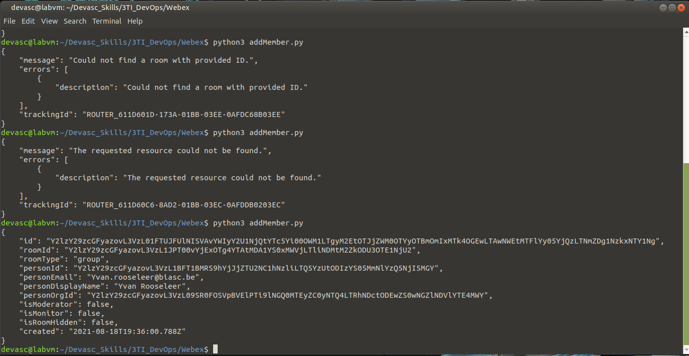

Devops: DEVASC SKILLS
============

Task 1 -- GitHub Skills Test
------------

Task Preperation

    Inloggen op github.com
    Remote repository aanmaken
    
Task implementation

    De directory "Devasc_Skills" aanmaken
    Git initialiseren
        "git init"
    README.md aanmaken in de dir
    Staging van alle bestanden
        git add .
    Tracking changes
        git commit -m "Task 1: Manage github scripts and documents"
    De lokale directory linken aan de remote repository
        git remote add origin https://github.com/ElioTcholakov/  Devasc_Skills.git
    Gestagede bestanden naar remote repository uploaden
        git push origin master

Task troubleshooting

    Wanneer ik de eerste keer probeerde te 'pushen' en dus mijn
    gebruikersnaam en wachwoord invulde, kreeg ik een error-bericht
    dat zei dat Github geen wachtwoorden meer accepteerd
    en dat ze nu met personal access tokens werken.
    Dit heb ik dan aangemaakt op github.com en vervolgens werkte mijn push
    wel wanneer ik de token dan invulde ipv mijn wachtwword.

Task verification

Screenshot of ...:

Task 2 -- Ansible Skills Test
------------

Task Preperation

    
Task implementation

    

Task troubleshooting

Task verification

Task 3 -- Docker
------------

Task Preperation

    Maak een lege DockerFile aan
    Maak een Ansible playbook aan met gegeven code
    
Task implementation

    

Task troubleshooting

Task verification

Task 4 -- Webex Teams API
------------

Task Preperation

    Inloggen op webex developer website met je webex account inloggen en je access token aanvragen.
    
Task implementation

    **Scripts gebaseerd op die van het labo 8.6.7**
    
    Authorizeren van mijn webex account:
    https://github.com/ElioTcholakov/3TI_DevOps/blob/master/Webex/authorization.png
    Aanmaken van een room:
    
    Het toevoegen van een member:
    
    Het sturen van een bericht:
    

Task troubleshooting

    Het was niet meteen duidelijk wat de room id was: (bv owner-id, id, ...)
    Uiteindelijk bleek het de eerste id te zijn die niet leek te werken de eerste keer
    zoals op de schermopname kan gezien worden.

Task verification
